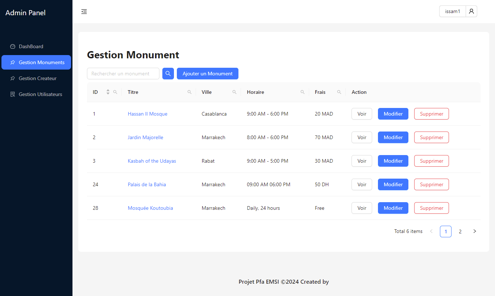

# Local Tour Guide Application Based on Geolocation

## Table of Contents


- [General Objective of the Project](#Objectif-générale-du-projet)
- [Project Architecture](#Architecture-du-projet)
- [Docker Compose](#Docker-compose)
- [Frontend](#Frontend) 
- [Backend](#Backend)
- [Images Demostration](#Images-Demostration)  
- [Contributors](#Contributeurs)

## General Objective of the Project
This mobile tourist guide project represents an ambitious and innovative initiative aiming to facilitate the discovery of a city's rich historical heritage. Focused on accessibility, comprehensive information, and interactivity, this mobile application positions itself as an essential tool for residents and visitors wishing to thoroughly explore local monuments and historical sites.
## Project Architecture

This tourist application is designed with a modern and scalable architecture. The backend is developed using the Express.js framework, providing a robust and secure API to manage the application's various functionalities. The admin front-end is built with React.js, a powerful JavaScript library for creating a dynamic and interactive user interface for administrators. This allows them to efficiently manage content, bookings, and user information. Concurrently, the client mobile part is developed using React Native, a framework for creating native applications for iOS and Android from a single codebase in JavaScript/TypeScript. This ensures a smooth and consistent user experience across different mobile devices while sharing much of the code between platforms. This modular architecture offers many benefits, including maintainability, scalability, and overall application performance.
## docker Compose
```yaml
version: "2.24.6"
services:
 mysql:
    image: mysql:8
    container_name: hossam-mysql-1
    environment:
      MYSQL_ALLOW_EMPTY_PASSWORD: 'yes'
      MYSQL_DATABASE: db_pfa
    volumes:
      - ./database:/docker-entrypoint-initdb.d
      - mysql-db:/var/lib/mysql
    ports:
      - "3306:3306"
 app_backend:
  image: hossamchalabi/backend:latest
  container_name: app_backend
  volumes:
   - ./app_backend:/app/backend:ro
  command: npm start
  ports:
   - "5000:5000"
  depends_on:
   - mysql
 app_frontend:
  image: hossamchalabi/frontend:latest
  container_name: app_frontend
  volumes:
    - ./app_front/src:/react/src:ro
  command: npm start
  ports:
    - "3000:3000"
  depends_on:
    - app_backend

volumes:
 mysql-db: {}

```
## Frontend

### Technologies Used
- React JS
- Ant Design
## Frontend Project Structure
The React JS front-end project is organized around five main parts, each serving a specific purpose and contributing to the overall architecture and maintainability of the application.

### 1. Login
**Objective:** The LOGIN component is responsible for managing administrator authentication in the application. It aims to ensure secure access to the application using the JWT (JSON Web Tokens) protocol.
**Functionality:** Administrators enter their credentials in a login form. The server authenticates these credentials and returns a securely stored JWT, which is then sent with each request to verify the administrator's identity and permissions.

### 2. Dashboard
**Objective:** The Dashboard component is responsible for visualizing key application statistics, such as information on monuments, creators, and users. It aims to provide administrators with an overview of the application's activity and performance.
**Functionality:** Displays the total number of monuments, users, and creators. Presents this information in a synthetic and visual manner. Real-time updates of key figures.

### 3. Creator
**Objective:** Allows administrators to manage information about creators registered in the application.
Functionality: Add, modify, and delete creators. Display a list of creators with filters. Link creators to the monuments they have created.

### 4. Monument
**Objective:** Allows administrators to manage information about monuments registered in the application.
Functionality: Add, modify, and delete monuments. Display a list of monuments with filters. View details of a specific monument and link monuments to their creators.

### 5. Tourist
**Objective:** Allows administrators to manage the accounts of tourists registered in the application.
Functionality: Deactivate tourist accounts. Display a list of users with filters. View details of a specific user and assign roles and permissions to users.

## Backend
### Technologies Used
- Express JS
- MySql
  
## Backend Project Structure
The backend developed with Express.js is connected to a MySQL database and consists of the following modules: models (Admin, Review, Creator, Monument, Tourist) defining the data structure, controllers handling business logic, and routes configuring the various API access points.

### 1. routes
Route files define the various API access points, configuring URLs, HTTP methods, and expected parameters for each endpoint. They are responsible for routing requests to the appropriate controllers.
### 2. controllers
Controller files handle incoming HTTP requests. Each controller is dedicated to a specific functionality or entity, exposing RESTful endpoints. These files interact directly with models to process requests and return appropriate responses.
### 3. .models
Model files represent the application's data. They define the data structure to be stored in the MySQL database. Each model generally corresponds to a table in the database.

## Launch the Application Locally:
1. **Clone the Project:**
   ```bash
   git clone <repository_url>
   cd <project_folder>
   ```
2. **Start Docker Desktop and launch docker-compose**
   ```bash
   docker compose up
   ```
   OU
    ```bash
   docker-compose up
   ```
3. **Change the URL_API in app_mobile/ServerLink.js and set your IP address**
4. **Start the mobile application**
   ```bash
   cd app_mobile
   npx expo start
   ```
### Images Demonstration
## Admin Part
.png)




## Mobile Part


## Contributors
- LIQALI Issam ([GitHub](https://github.com/travolta11))
- CHALABI Hossam ([GitHub](https://github.com/hossam1956))
- JAAFARI CharafEddine ([GitHub](https://github.com/CharafEddineJaafari))
- ERRABIH Abdelmoughit ([GitHub](https://github.com/AbdelmoughitERRABIH))
- ABID Hanane ([GitHub](https://github.com/hananabid24))
- LACHGAR Mohamed  ([Researchgate](https://www.researchgate.net/profile/Mohamed-Lachgar))

